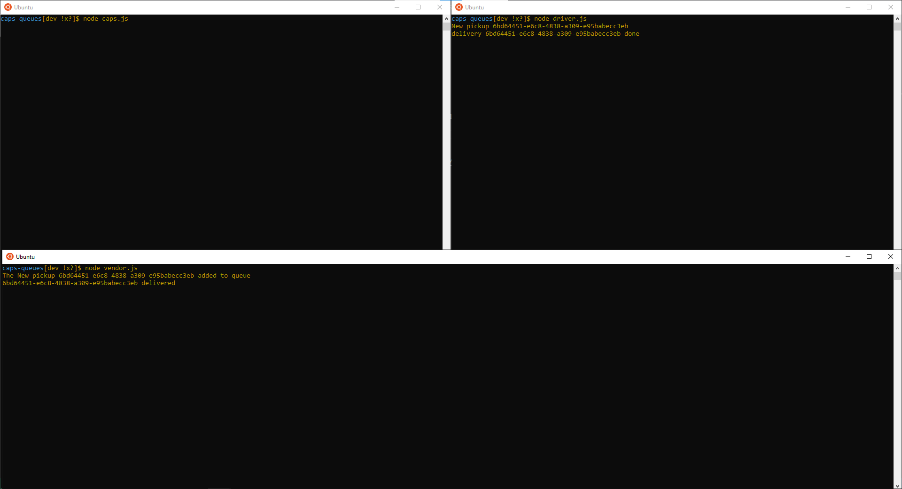
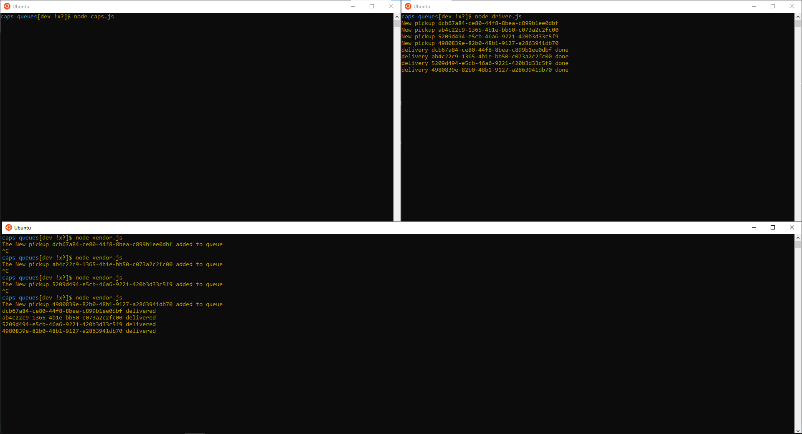
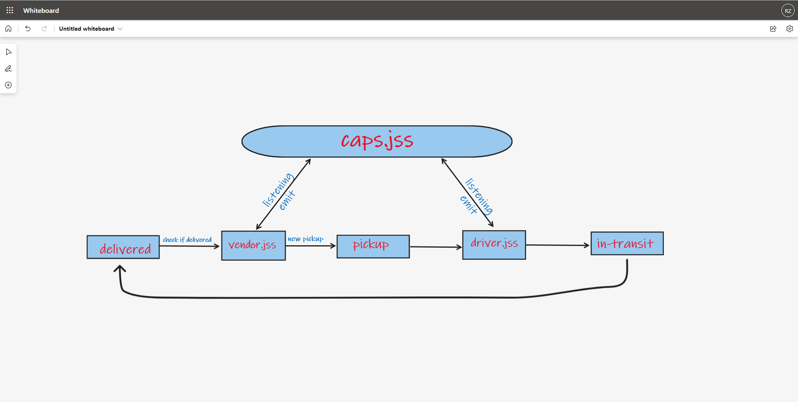

# caps-queues

## Lab 13
## Author: 
- Rami Zregat

**Description of the lab:**  
In this lab, we’ll be adding a layer of complexity to our application. Rather than just “fire” events and hope that our vendors and drivers respond to them, we’re going to implement a “queue” system so that nothing gets lost. Every event sent will be logged and held onto by the server until the intended recipient acknowledges that they received the message. At any time, a subscriber can get all of the messages they might have missed.

## Links to check:

- Github pull request link: https://github.com/RamiZregat/caps-queues/pull/1

## Dependencies:  

- jest
- faker
- socket.io
- socket.io-client

## How to start the application:  
- node caps.js
- node vendor.js
- node driver.js

## Output result
 ### Start all 3 servers:
 

 ### Stop one of your applications servers:
 

## UML
